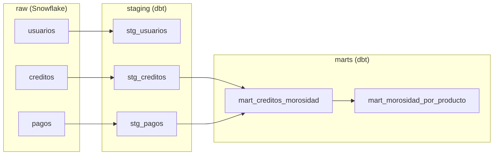

# PrestaMX — Credit Data Pipeline (ELT)

Pipeline de datos **ELT en la nube** para una fintech de credito ficticia. Toma datos crudos de una financiera, los carga sin transformar a un data warehouse, y los modela por capas con dbt para responder preguntas de negocio clave como la **tasa de morosidad** y el **saldo en riesgo**.

---

## Contexto de negocio

"PrestaMX" es una fintech mexicana de creditos (personales, de nómina y PyME) que crecio rapido y tiene sus datos dispersos e inconsistentes. El pipeline entrega datos limpios y confiables, y responde 5 preguntas del area de datos:

1. **Tasa de morosidad** — ¿que % de la cartera esta en mora? (por producto)
2. **Saldo en riesgo** — ¿cuanto dinero está pendiente en creditos morosos?
3. **Comportamiento de pago** — ¿que % de cuotas se pagan a tiempo, tarde o no se pagan?
4. **Originacion** — ¿cuanto se ha colocado por producto?
5. **Cartera por estatus** — distribucion de creditos (vigente/pagado/mora/castigado).

Un requisito clave del cliente: *el campo `estatus` de la fuente no es confiable, así que la morosidad real se calcula desde los pagos, no desde esa etiqueta.*

---

## Arquitectura (ELT en capas)

A diferencia de un flujo batch simple, este pipeline sigue el patron **ELT en 3 capas**: los datos crudos entran al warehouse sin transformar (**raw**), se limpian y tipan con SQL (**staging**), y se agregan en metricas de negocio (**marts**). dbt deduce el orden de construccion automaticamente a partir de las referencias entre modelos.

---

## Stack

- **Data warehouse:** Snowflake
- **Transformacion:** dbt (dbt Cloud) — modelado por capas con SQL
- **Origen de datos:** carga de CSV crudos a Snowflake
- **Control de versiones:** Git / GitHub (flujo con ramas y Pull Requests)
- **Generacion de datos:** Python + Faker

---

## El pipeline por capas

**Raw** — Las 3 fuentes (usuarios, creditos, pagos; ~80K registros) se cargan a Snowflake como texto, sin transformar. Es la fuente de verdad intacta.

**Staging** — Un modelo por tabla que limpia y tipa los datos con SQL:
- Estandarizacion de categorias (producto, estatus, segmento) con `CASE`.
- Conversion de fechas en 3 formatos mezclados con `coalesce` + `try_to_date`.
- Conversion de montos a numero con `try_to_number`.
- **`stg_pagos`** deriva la logica de morosidad por cuota: clasifica cada cuota en *Pagada*, *Por vencer* o *Vencida impaga*, y calcula los **dias de atraso** con `datediff`.

**Marts** — Agregacion con logica de negocio:
- `mart_creditos_morosidad`: a nivel credito, marca si esta **en mora** (≥1 cuota vencida impaga) y calcula el **saldo pendiente**.
- `mart_morosidad_por_producto`: la **tasa de morosidad** y el **saldo en riesgo** por producto.

---

## Calidad de datos (tests de dbt)

El proyecto incluye tests automaticos que validan la calidad en cada ejecucion:
- `unique` y `not_null` en las llaves primarias.
- `accepted_values` en las columnas categoricas (segmento, producto) para confirmar la estandarizacion.

**Hallazgo real:** el test `unique` detecto **25 usuarios duplicados** en la fuente; se resolvieron con una deduplicacion en la capa staging. (10/10 tests en verde.)

---

## Resultados de negocio

El mart final responde directo las preguntas #1 y #2 del cliente: **tasa de morosidad** y **saldo en riesgo** por producto (Personal, Nómina, PyME), calculadas desde el comportamiento de pago real y no desde la etiqueta de estatus de la fuente.

---

## Como reproducirlo

1. Generar los datos: `python gen_fintech.py`.
2. Crear base y esquema en Snowflake y cargar los 3 CSV al esquema `raw`.
3. Conectar dbt Cloud a Snowflake y a este repo.
4. Construir el pipeline: `dbt run` (dbt ordena los modelos solo).
5. Validar la calidad: `dbt test`.

---

## Notas y limitaciones

- Los datos son **sinteticos** (generados con `Faker`), diseñados con imperfecciones realistas para practicar el pipeline. No representan datos reales de ninguna financiera.

---

